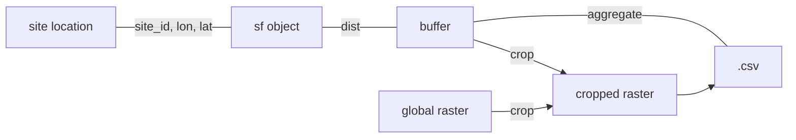

<!-- README.md is generated from README.Rmd. Please edit that file -->

# endow

<!-- badges: start -->
<!-- badges: end -->

The package simplifies data collection and data processing pipelines for
the ENDOW project. The code can be re-used to collect a series of
gespatial variables for a given point on Earth.

## Installation

You can install the development version of endow from
[GitHub](https://github.com/) with:

``` r
# install.packages("devtools")
devtools::install_github("barguzin/endow")
```

## Example

Endow package provides a series of utility functions to simplify data
collection. Typically, the pipeline is set in a following way: 



``` r
library(endow)

## basic example code
# create a point
my_point = endow::make_point("site A", lon=45, lat=45)

# create a buffer 
my_buffer = endow::make_buffer(my_point, dist=5000) # dist in meters 

df = read.csv(path_to_file) 

pop2000 = 'file/path/to/raster.tiff'

mapply(endow::collector, pop2000, 'dir/to/save/processed', 
       year=2000, 
       year_var = df$start, 
       site_id = df$end, 
       lon=df$lng, lat=df$lat, dist=5000, 
       var_name='raster_var')


```
